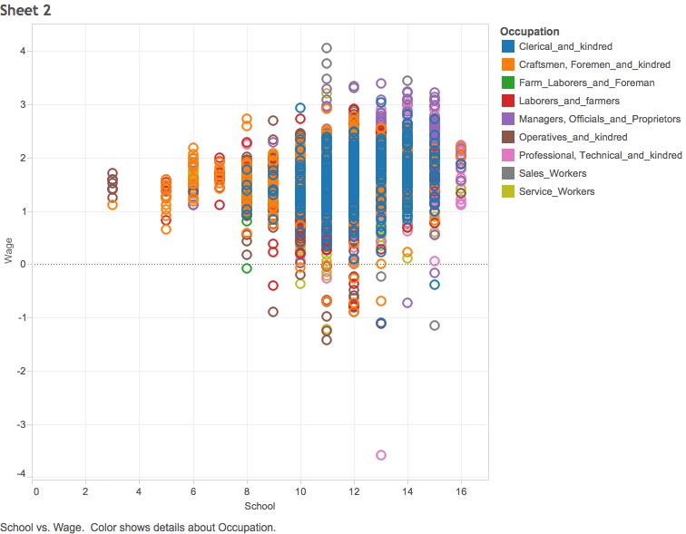

## Step 1: Load CSV File into Tableau and Oracle

*Our data represents wages and education of young males in the United States. We have a total number of 4360 observations from 1980 to 1987.

***Process*** <br/>
1. Insert csv file as a data source into Tableau <br/>
2. Load the csv file into Oracle account using a modified version of R_ETL.R. We could not do this due to problems with the server, but we've created our a modified version of R_ETL.R.

```{r, eval=FALSE}
require(tidyr)
require(dplyr)
require(ggplot2)

setwd("~/DataVisualization/DV_RProject4/01 Data")

file_path <- "Males.csv"

df <- read.csv(file_path, stringsAsFactors = FALSE)

# Replace "." (i.e., period) with "_" in the column names.
names(df) <- gsub("\\.+", "_", names(df))

# str(df) # Uncomment this and  run just the lines to here to get column types to use for getting the list of measures.

measures <- c("Calculated KPI", "Exper", "F1", "Nr", "School", "Wage")
#measures <- NA # Do this if there are no measures.

# Get rid of special characters in each column.
# Google ASCII Table to understand the following:
for(n in names(df)) {
  df[n] <- data.frame(lapply(df[n], gsub, pattern="[^ -~]",replacement= ""))
}

dimensions <- setdiff(names(df), measures)
if( length(measures) > 1 || ! is.na(dimensions)) {
  for(d in dimensions) {
    # Get rid of " and ' in dimensions.
    df[d] <- data.frame(lapply(df[d], gsub, pattern="[\"']",replacement= ""))
    # Change & to and in dimensions.
    df[d] <- data.frame(lapply(df[d], gsub, pattern="&",replacement= " and "))
    # Change : to ; in dimensions.
    df[d] <- data.frame(lapply(df[d], gsub, pattern=":",replacement= ";"))
  }
}

library(lubridate)
# Fix date columns, this needs to be done by hand because | needs to be correct.
#                                                        \_/
df$Order_Date <- gsub(" [0-9]+:.*", "", gsub(" UTC", "", mdy(as.character(df$Order_Date), tz="UTC")))
df$Ship_Date  <- gsub(" [0-9]+:.*", "", gsub(" UTC", "", mdy(as.character(df$Ship_Date),  tz="UTC")))

# The following is an example of dealing with special cases like making state abbreviations be all upper case.
# df["State"] <- data.frame(lapply(df["State"], toupper))

# Get rid of all characters in measures except for numbers, the - sign, and period.dimensions
if( length(measures) > 1 || ! is.na(measures)) {
  for(m in measures) {
    df[m] <- data.frame(lapply(df[m], gsub, pattern="[^--.0-9]",replacement= ""))
  }
}

write.csv(df, paste(gsub(".csv", "", file_path), ".reformatted.csv", sep=""), row.names=FALSE, na = "")

tableName <- gsub(" +", "_", gsub("[^A-z, 0-9, ]", "", gsub(".csv", "", file_path)))
sql <- paste("CREATE TABLE", tableName, "(\n-- Change table_name to the table name you want.\n")
if( length(measures) > 1 || ! is.na(dimensions)) {
  for(d in dimensions) {
    sql <- paste(sql, paste(d, "varchar2(4000),\n"))
  }
}
if( length(measures) > 1 || ! is.na(measures)) {
  for(m in measures) {
    if(m != tail(measures, n=1)) sql <- paste(sql, paste(m, "number(38,4),\n"))
    else sql <- paste(sql, paste(m, "number(38,4)\n"))
  }
}
sql <- paste(sql, ");")
cat(sql)
```

## Step 2: Create a barchart

*The visualization below shows that higher pay in more physical jobs have a correlation with health problems.

***Process*** <br/>
1. Drag "Occupation" and "Health" into columns <br/>
2. Drag "Wage" into rows and make the measure a median <br/>
3. Drag "Health" to color <br/>
4. Add reference line for entire table <br/>


## Step 3: Create a scatterplot
*The visualization below shows that to get decent wages, people need to have between 11 to 14 years of schooling. 

***Process*** <br/>
1. Drag "School" into columns <br/>
2. Drag "Wage" into rows <br/>
3. Drag "Occupation" into colors <br/>



## Step 3: Create a crosstab
*What stood out in the data is the blacks were most experienced as laborers and farmers, as well as managers, officials and proprietors in the professional and related service industry and public administration industry compared to Hispanics, and other racial ethnicities including White people, Asians, and Native Americans. 

***Process*** <br/>
1. Drag "Industry" into columns <br/>
2. Drag "Occupatoin" and "Ethnicity" into rows <br/>
3. Drag "Experience" into text and change measure into average <br/>
4. Create KPI called "Max Low KPI". Data type is float and current value is 7. <br/>
5. Create KPI called "Max Median KPI". Data type is float and current value is 10. <br/>
6. Create "Calculated KPI" with the following if statement: <br/>

if AVG([Exper]) <= [Max Low KPI] then 'Low' <br/>
elseif AVG([Exper]) <= [Max Median KPI] then 'Medium' <br/>
else 'High' <br/>
end

7. Drag Calculatd KPI to color. 


